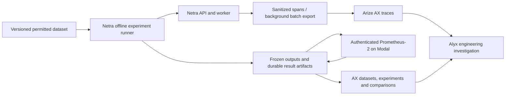

# Arize AX tracing and evaluation integration

Decision: **18 September 2026 — approved target, implementation pending.** Arize
AX is Netra's managed destination for sanitized traces, datasets, experiments,
comparison views and engineering investigation with Alyx. Prometheus-2 7B on
Modal remains the external LLM judge. This decision replaces the historical
LangSmith tracing choice; CloudWatch/application operational logs remain.

Build a complete, tested integration with low response-path overhead. A single
successful trace or scored example is a connectivity check, not acceptance.
Do not trade correctness, calibration or recovery for a quick pilot. The expected
evaluation workload fits the Free tier; high-volume infrastructure is out of scope.

Read with the [model/evaluation plan](model-evaluation-plan.md),
[runtime baseline](runtime-baseline.md), [data ownership](data-ownership.md),
[message flow](message-flow.md) and [integration checklist](../team/integration-checklist.md).
These are implementation requirements, not claims of executed checks or deployment.

## Architecture and boundaries

- M1 owns the common tracing boundary and process lifecycle. Domain owners emit
  spans through it; domain code must not depend on AX SDK types. M4 owns the
  offline runner, judge adapter and AX dataset/experiment adapter in `evaluation/`.
- AX is an external engineering/telemetry service, not a new Netra production
  microservice. Exactly two product agents remain: Coordinator and Tutor. Alyx
  helps engineers; it does not receive student turns, choose tools or commit
  learning/session state. Prometheus is a bounded evaluator, not an agent.
- Student responses never await AX export, experiment uploads or judge calls.
  AX/Modal availability is not an application boot/readiness dependency. Existing
  access control, cancellation, 4/6/20 budgets and authoritative writes remain.
- PostgreSQL/private S3 retain their existing authority. AX traces, dataset copies
  and experiment views cannot replace student history, access checks or evidence
  provenance. Keep reproducible evaluation artifacts independently of AX retention.
- Use one tracing stack: OpenTelemetry with selected OpenInference semantics,
  exported to AX. Do not add LangSmith dual export, a Phoenix server, a collector
  deployment, queues/brokers, autoscaling or distributed evaluation orchestration.
  A background batch exporter and a resumable local runner are sufficient here.

## Reliable tracing with low response-path overhead

The [AX tracing configuration](https://arize.com/docs/ax/observe/tracing/configure)
supports OpenTelemetry instrumentation and span processors. The following are
Netra's required design and verification choices, not vendor delivery guarantees.

1. Initialize one tracer provider per API/worker process, once in composition.
   Inject a small Netra-owned tracing interface into services. Use bounded
   background batching, explicit export timeouts and bounded retries. Request
   execution only creates/ends spans and enqueues sanitized data in memory;
   it performs no AX network call, blocking flush or telemetry disk write.
2. Capture all spans for the evaluation workload. Do not sample away failures or
   reduce span coverage merely to target ten spans per request. Use meaningful
   operation boundaries, not a span per streamed token, audio frame or poll.
   Disable duplicate instrumentation and automatic raw input/output capture.
3. Trace authenticated request dispatch, deterministic routing or Coordinator
   execution, each provider attempt, retrieval and authoritative evidence checks,
   multimedia work, Tutor handoff, learning commit and response/speech operations
   where applicable. Record selected evidence, a detected gap, changed action and
   validated outcome as structured facts; never expose private reasoning.
4. Maintain async context isolation between simultaneous requests. Distinguish
   domain `request_id` from trace/span identity and provider-attempt identity;
   retries/replays must not fabricate extra effects. A retry is a recorded attempt,
   not another successful logical action. Do not trust arbitrary client trace
   attributes as authorization or allow them to disable required tracing.
5. Link durable worker executions to their originating operation through reviewed
   internal job metadata; each job attempt has its own bounded span lifecycle.
   Do not keep a request span open while a queued job waits. M2 reviews metadata
   persistence; existing contracts remain authoritative. No undocumented wire or
   database fields may be introduced to carry tracing context.
6. End spans on success, error, timeout and cancellation; distinguish these
   outcomes and distinguish sent audio from actually played/acknowledged audio.
   Use safe error codes, not unrestricted exception strings. Keep session/source
   version and commit outcome facts accurate under replay and failed transactions.
7. Export failure must not fail a student operation or block STOP. Expose safe
   local health counters for created/exported/failed/dropped spans, queue pressure,
   configuration errors and final-flush outcome. Rate-limit repetitive diagnostics.
   Queue overflow and process crashes can lose spans: make this visible, never
   claim exactly-once delivery or silently report a complete evaluation trace.
8. Flush on orderly shutdown with a bounded deadline outside response execution;
   record failures without indefinitely delaying termination. No per-turn flush.
   Test unreachable AX, invalid credentials, rate limits, full queues, cancellation,
   concurrent context isolation and shutdown. Telemetry errors cannot recursively
   instrument their own exporter or change domain retry/budget behaviour.
9. For evaluation runs, persist an expected-operation/span manifest outside the
   student response path. Reconcile ended/exported spans with AX ingestion by IDs
   after a bounded wait; exporter acknowledgement alone is not visibility proof.
   Mark traces complete, pending or incomplete with reasons. Missing traces block
   trace acceptance and are investigated/recovered or the affected fixture rerun;
   do not rerun student mutations to repair observability.
10. Measure instrumented versus disabled tracing on the same fixture/environment,
    including a slow/unavailable exporter. Report sample count, response and
    first-response latency distributions, event-loop responsiveness and STOP
    behaviour. M1/M5 review measured overhead against existing response semantics;
    do not invent an unmeasured zero-overhead claim or relax existing deadlines.

## Data minimization and correlation

Apply an explicit allowlist before a span enters any exporter or local diagnostic
artifact. Include service/build, operation, provider/model, safe status, timings,
available token usage, opaque case/run/request IDs and permitted evidence/version
references. Treat absent usage/cost as unknown, not zero. Use pseudonymous identifiers
where cross-run correlation is necessary; hashes are not permission to export data.

Exclude credentials, authorization headers, signed URLs/query strings, raw audio,
private student text/history, private assessment answers/rubrics and private chain
of thought. Do not record entire request bodies, tool arguments, exception messages
or provider responses by default. Test nested attributes/events and error paths,
not only successful spans. Any optional automatic instrumentation must enforce
the same capture exclusions and sanitization before export.

Reviewed synthetic/public evaluation cases may contain task text, candidate output,
source excerpts and reference answers in a deliberately scoped evaluation dataset.
This exception does not enable raw content tracing for ordinary student traffic.
Dataset promotion requires source permission, redaction and human review; Alyx
suggestions and production traces do not automatically become evaluation ground truth.

WPF holds no AX or Modal credentials and sends no telemetry directly to AX. M5
measures STOP-to-silence on the client with a monotonic clock, preserving generation
and existing request identity in permitted test artifacts. Do not subtract timestamps
from different machines for latency. M1/M5 review any additional diagnostics transport
under existing schema controls; this decision adds no public protocol fields.

## Five-step evaluation workflow

1. **Build a small reference dataset.** M4 coordinates stable case IDs, source/version
   locators, permitted source artifacts, expected outcomes and human-reviewed
   reference answers with M1–M5. Cover the Ohm's Law journey plus sufficient evidence,
   missing/unreadable evidence, unsupported claims, units, alternative reasoning,
   assisted attempts, injection, replay/cancellation and media/accessibility failures.
   Record labels' author/reviewer and distinguish human gold from suggested labels.
   Keep development/calibration cases separate from a frozen held-out comparison set.
2. **Perform error analysis.** Inspect source evidence, deterministic failures and
   representative traces; group actual failure modes before choosing scoring criteria.
   Alyx can help explore failures. Humans decide whether the root cause is retrieval,
   source interpretation, reasoning, teaching, state handling or delivery. Expand
   coverage when gaps emerge; a small dataset is a starting size, not a quality cap.
3. **Name each evaluation.** Use stable, versioned names such as `source_support_v1`,
   `factual_correctness_v1`, `question_relevance_v1`, `teaching_usefulness_v1` and
   separate deterministic/accessibility checks. Record applicability and units;
   do not turn unlike criteria into one unexplained average or a mastery score.
4. **Write and calibrate the rubric.** Use source-checked references and anchored
   1–5 Prometheus rubrics, strict parsing and human disagreement analysis from the
   [judge plan](model-evaluation-plan.md#evaluation-quality-and-scoring-workflow).
   At least ten human-labelled development cases is a starting floor, not proof of
   reliability. Review false high scores on unsupported answers; expand calibration
   until the intended failure modes are assessed. Version approved rubrics, templates
   and adjudications. Frozen held-out cases must not be used for iterative tuning.
5. **Run the judge and compare.** Generate outputs through reviewed Netra boundaries
   in isolated fixture state, persist them, then run deterministic checks and the
   external Modal judge. Upload dataset/experiment records and structured scores,
   feedback and explicit errors through the AX adapter. Confirm ingestion and show
   a paired baseline/candidate comparison with trace links and human review.

Text judging cannot establish original-media fidelity, authorization correctness,
NVDA usability or actual audio stopping. Those remain source, deterministic and
human checks owned by the relevant members. A low-quality or unavailable judge
leaves that evaluation incomplete; it does not authorize an automatic model swap.

## Reproducible datasets, experiments and recovery

Use AX datasets/experiments for authoring review and analysis, with immutable local
snapshots and result artifacts as the reproducibility record. Persist a dataset
content hash, stable case IDs, split, references/labels, source versions, rubric
versions, producer commit/prompt/model/configuration, judge checkpoint/tokenizer,
image/dependencies/dtype/generation settings, seed where applicable and run IDs.
Map the snapshot to AX dataset/version, experiment, case/task and trace/span IDs;
names alone are insufficient. Export accepted AX edits as a new reviewed snapshot.

M4's runner owns external computation. The [AX experiment SDK workflow](https://arize.com/docs/ax/develop/datasets-and-experiments/run-experiment)
supports tasks and evaluator results with score/label/explanation. Choose APIs
matching a reviewed SDK pin; do not mix SDK-major examples or require AX-hosted
custom Python evaluators. Keep all SDK objects behind an evaluation-owned adapter.

- Persist candidate outputs before judging, and each judge result before uploading.
  Maintain explicit generated/scored/upload-pending/confirmed/error states with
  attempt identity. Keep scores separate from not-applicable, missing, invalid and
  failed outcomes; missing scores are neither zero nor passing. The current boolean
  evaluation scaffold needs a reviewed ordinal/result representation, not coercion.
- Use stable run/case/repetition/criterion keys and checkpoint after each unit.
  On timeout after an upload, reconcile AX IDs/records before retrying. If the
  selected API cannot reconcile ambiguous creation, stop with an operator recovery
  record instead of blindly duplicating experiments. Never rerun Netra or spend
  another judge call just because an AX upload failed. Cache reuse is explicit.
- Resume AX uploads from saved artifacts after outages. Resume judge work only
  after reconciling uncertain Modal completion under its budget/authentication
  controls. Preserve expected and completed counts, reasons and pending cases.
- Compare baseline and candidate using the same held-out snapshot, references,
  criterion applicability, rubrics and judge configuration. Reset isolated state
  consistently; the second run must not inherit the first run's effects. Record
  intended producer changes and confounding changes. Judge/rubric changes require
  rescoring both frozen output sets under a new comparison identity.
- Report per-case paired changes, ordinal distributions, regressions by criterion
  and failure category, deterministic failures, human disagreements, missing-case
  counts and trace completeness. Show denominators and labelled reused results.
  An incomplete pair is a partial report, not evidence that the candidate improved.
  Small samples do not establish statistical significance; fixed decoding does not
  guarantee bitwise identical results. A mean judge score cannot override a critical
  access, evidence, state or accessibility failure. M4/domain owners record explicit
  acceptance criteria before reviewing held-out results.

## Free-tier sizing and Alyx

As checked on 18 September 2026, [AX pricing](https://arize.com/pricing/) lists
25,000 spans/month, 1 GB ingestion/month and 15-day retention for Free, plus
datasets and experiments. Roughly 2,500 fully traced requests assumes ten spans
each; it is a planning estimate, not a per-request allowance. Worker and evaluation
spans also consume capacity. Measure actual usage, preserve needed spans and stop
additional evaluation batches if capacity is exhausted. Do not build sampling or
high-volume pipelines to stretch the estimate. Save artifacts before trace expiry;
do not assume the same retention rules for every AX object. Verify actual account
entitlements. Managed custom-code evaluators/repository access are not assumed on
Free, and neither AX nor Modal may silently switch to a paid tier.

[Alyx](https://arize.com/docs/ax/alyx) can investigate traces and help construct
datasets, evaluations and experiments. Its engineering suggestions still require
review: keep change auto-accept disabled, verify labels/rubrics and evaluate proposed
fixes against the frozen comparison set. Do not treat generated explanations as
ground truth or claim that Alyx replaces code review. Its availability/allowance
must be checked in the account; no unlimited entitlement or automatic repository
editing is promised. AX/Alyx processing is an external data boundary, so the same
content restrictions apply. No unattended judge spending or prompt deployment.

## Owners, dependencies and acceptance

| Owner | Delivery and integration responsibility |
|---|---|
| M1 | Shared tracing interface, safe composition/configuration, sanitization, async context, exporter lifecycle, trace completeness and response overhead with M5. |
| M2 | Ingestion/retrieval/source-validation and job spans; reviewed internal correlation; source/relevance fixtures; tracing dependency review with M1 and GPU isolation review with M4. |
| M3 | Media retrieval/analysis spans and evidence provenance; original-media ground truth; cases separating extraction errors from unsupported explanations. |
| M4 | Tutor/learning spans; dataset snapshots, rubric/calibration, resumable Modal runner, AX adapter, uploads/reconciliation, paired comparisons and human adjudication. |
| M5 | Real client playback/STOP/return measurements, request/generation correlation, keyboard/NVDA evidence and accessible behaviour during telemetry/judge outages. |

Runtime pins/installations remain governed by [runtime baseline](runtime-baseline.md).
M1/M2 review a minimal compatible OpenTelemetry/exporter and selected OpenInference
dependency set for Python 3.13.15 and the shared API/worker lock. M4 keeps the AX
experiment SDK and GPU environment separate from the application runtime unless
explicitly reviewed otherwise. No broad framework instrumentation or dependency
upgrade is implied by vendor examples; exact compatible pins remain pending.

Acceptance requires connected Netra traces for the covered success/failure journeys,
sanitization/context-isolation and nonblocking-export tests, trace reconciliation,
measured overhead, a reviewed versioned dataset, calibrated Prometheus scoring,
recoverable partial runs/uploads, and a reproducible before/after AX comparison
backed by independent artifacts. Test schema/configuration errors, partial uploads,
ambiguous timeouts, duplicate resume, rate limits, shutdown, judge failure and
capacity exhaustion. Preserve student behaviour throughout. Record local fixture,
real integration, live AX/Modal and Windows/NVDA evidence separately.

The authorized change here is documentation and member instructions. Code,
dependency installation, account/secret setup and live execution are not performed
by this revision. Future role implementation must meet all these gates; blocked
live checks remain explicit rather than being replaced by a successful mock.
